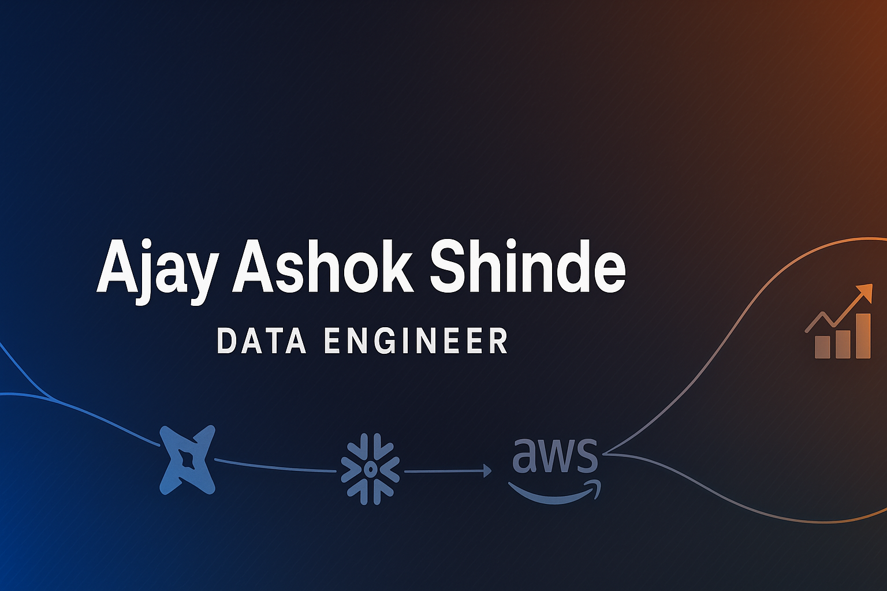

<!-- Ajay Shinde - GitHub Profile README -->

  

<!-- Ajay Shinde - GitHub Profile README -->

<h1 align="center">👋 Hi, I'm Ajay Ashok Shinde</h1>
<h3 align="center">🚀 Data Engineer | M.S. Information Systems @ Syracuse University</h3>

  
  
  
  

---

### 🧠 About Me

🎓 I’m a **Data Engineer** with 3+ years of experience building high-volume **ETL pipelines, data warehouses, and streaming systems** across 25 TB+ datasets.  
💡 I turn raw data into structured, reliable insights that empower analytics and decision-making.  
⚙️ I love designing scalable data workflows using modern tools — **Airflow, dbt, Spark, Kafka, Snowflake, Databricks, AWS, and Azure.**  
🌱 Currently learning **real-time analytics, lakehouse design, and data observability frameworks.**  
💬 Ask me about **data modeling, pipeline orchestration, or performance tuning.**

---

### 🏗️ Featured Projects

| Project | Description | Stack |
|----------|--------------|--------|
| 🏥 **[Patient Outcome Analytics Pipeline](https://github.com/ajay1018/patient-outcome-analytics-pipeline)** | Automated EHR ingestion (FHIR/HL7) with Airflow + Snowflake + dbt + Power BI → reduced manual work by 65%. | Airflow • Snowflake • dbt • Power BI |
| 💳 **[Real-Time Fraud & Compliance Pipeline](https://github.com/ajay1018/real-time-fraud-compliance-pipeline)** | Kafka + Spark + Snowflake streaming for financial reconciliation → cut false positives by 40%. | Kafka • Spark • Databricks • Snowflake |
| 🛍️ **[Customer Analytics & Recommendation Platform](https://github.com/ajay1018/customer-analytics-recommendation-platform)** | Airflow + Redshift + Streamlit + dbt pipelines for CLTV analysis → 75% faster updates. | Airflow • Redshift • dbt • Streamlit |

---

### ⚙️ Tech Stack

#### 💻 Languages

#### 🧩 Data Engineering

#### ☁️ Cloud & Storage

#### 📊 Visualization & Tools

---

### 📈 GitHub Analytics

  
  

  

---

### 🧠 Fun Fact
> “Data Engineering is like architecture — pipelines are bridges, schemas are blueprints, and dashboards are the windows that reveal the structure’s beauty.”

---

<h3 align="center">🌐 Connect With Me</h3>

  
  
  

---

  <i>⭐️ “Transforming data into decisions — one pipeline at a time.” ⭐️</i>

